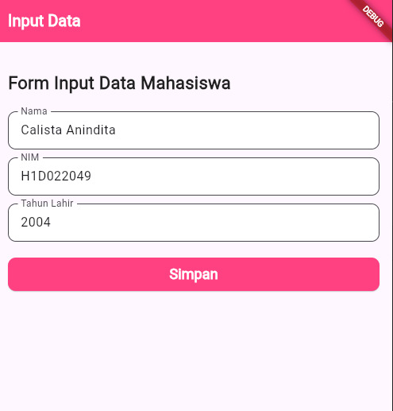
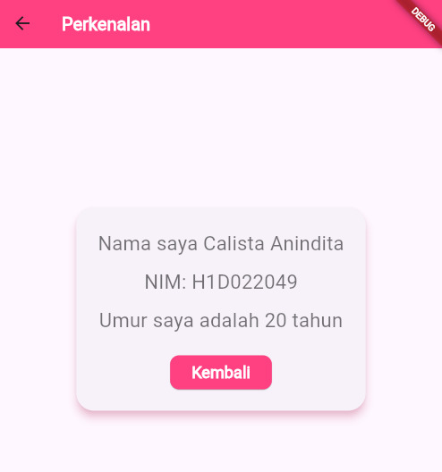

# Tugas Pertemuan 2

Menjelaskan Proses Passing Data Dari Form Menuju Tampilan
1.	Mengimpor Paket dan File
    a. 	import '/ui/tampil_data.dart'; 
        Mengimpor file yang kemungkinan berisi class untuk menampilkan data yang telah dikirimkan.
    b. 	import 'package:flutter/material.dart';
        Mengimpor paket flutter untuk membangun UI aplikasi.
    c. 	import 'package:flutter/widgets.dart';
        Mengimpor paket untuk membangun antarmuka pengguna di flutter.
2.	Class FormData
    Class FormData digunakan untuk membut form input data dengan mengextends class StatefulWidget yang berarti pada class ini data dapat berubah sesuai input dari pengguna. Di dalam juga terdapat FormDataState createState() => FormDataState(); Yang digunakan untuk membuat state (data) dari widget untuk dapat dikelola di dalam FormDataState.
3.	Class FormDataState
    Class FormDataState digunakan untuk mengelola state dari widget FormData. Terdapat 3 objek TextEditingController di dalam FormDataState.
    a. 	_namaController
        Digunakan sebagai input nama.
    b. 	_nimController
        Digunakan sebagai input NIM.
    c. 	_tahunController
        Digunakan sebagai input tahun lahir.
    Widget build(BuildContext context) digunakan untuk membangun antarmuka pengguna. Dengan melakukan return Scaffold widget utama dapat menyediakan struktur dasar dari antarmuka pelanggan berbasis material design di flutter. Dalam hal ini, Scaffold digunakan untuk membuat halaman input data dengan AppBar di atas dan konten utama di dalam body. Di dalam body sendiri terdapat child: Column untuk menempatkan elemen-elemen UI di dalam children yang ditumpuk secara vertikal dari atas ke bawah. Berikut merupakan children yang ada pada body.
        a. 	_textboxNama
            Menghasilakn textfield untuk memasukkan nama dan akan disimpan di _namaController.
        b. 	_textboxNIM
            Menghasilakn textfield untuk memasukkan NIM dan akan disimpan di  _nimController.
        c. 	_textboxTahun
            Menghasilakn textfield untuk memasukkan tahun lahir dan akan disimpan di  _tahunController.
    Di dalam _tombolSimpan() terdapat fungsi yang akan menampilkan tombol ElevatedButton yang ketika ditekan akan mengambil data yang diinputkan pada masing-masing controller kemudian akan menampilkan halaman TampilData yang berisi data yang telah diinputkan.
4.	Class TampilData
    Class TampilData mengextends StatelessWidget yang berarti widget ini tidak memiliki state (data) yang dapat diubah setelah dibangun.
    Widget ini memiliki tiga variabel final:
        a. 	nama: String untuk menyimpan nama yang dimasukkan pengguna.
        b. 	nim: String untuk menyimpan NIM.
        c. 	tahun: Integer yang menyimpan tahun lahir pengguna.
    Pada body yang digunakan untuk menampilkan data terdapat children yang berisi text yang akan menampilkan “Nama saya $nama, NIM $nim, dan umur saya adalah $umur tahun” dengan masing-masing $nama, $nim, dan $umur sebagai berikut.
        a. 	$nama
            $nama merupakan nama pengguna yang sebelumnya telah diinputkan oleh pengguna di textfield. 
        b. 	$nim
            $nim merupakan NIM pengguna yang sebelumnya telah diinputkan oleh pengguna di textfield.
        c. 	$umur
            $umur merupakan umur pengguna yang sebelumnya telah diinputkan oleh pengguna di textfield tahun lahir. Umur berasal dari dari operasi int umur = DateTime.now().year - tahun; yang lebih dulu didefinisikan sebelum body. Baris ini digunakan untuk menghitung umur pengguna dengan cara mengurangi tahun lahir (tahun) dari tahun saat ini (DateTime.now().year) yang kemudian disimpan di dalam variabel umur.

## Screenshot

